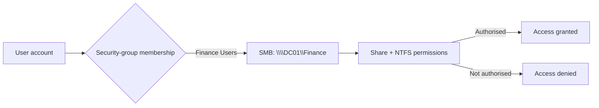

# Access-Control Flow

```mermaid
flowchart LR
    User["User account"] --> Membership{"Security-group membership"}
    Membership -->|Finance Users| Share["SMB: \\\\DC01\\Finance"]
    Share --> ACL["Share + NTFS permissions"]
    ACL -->|Authorised| Allow["Access granted"]
    ACL -->|Not authorised| Deny["Access denied"]
```

