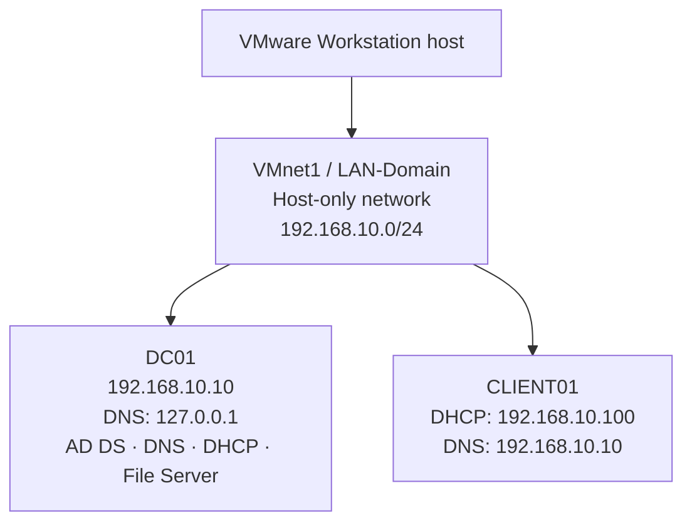

# Network Topology

```mermaid
flowchart TB
    Host["VMware Workstation host"] --> VMnet["VMnet1 / LAN-Domain<br/>Host-only network<br/>192.168.10.0/24"]
    VMnet --> DC["DC01<br/>192.168.10.10<br/>DNS: 127.0.0.1<br/>AD DS · DNS · DHCP · File Server"]
    VMnet --> Client["CLIENT01<br/>DHCP: 192.168.10.100<br/>DNS: 192.168.10.10"]
```

