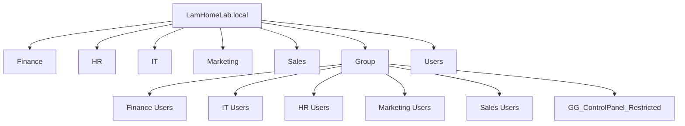

# OU and Group Structure

```mermaid
flowchart TB
    Domain["LamHomeLab.local"] --> Finance
    Domain --> HR
    Domain --> IT
    Domain --> Marketing
    Domain --> Sales
    Domain --> Group
    Domain --> Users
    Group --> FinanceUsers["Finance Users"]
    Group --> ITUsers["IT Users"]
    Group --> HRUsers["HR Users"]
    Group --> MarketingUsers["Marketing Users"]
    Group --> SalesUsers["Sales Users"]
    Group --> Restricted["GG_ControlPanel_Restricted"]
```

